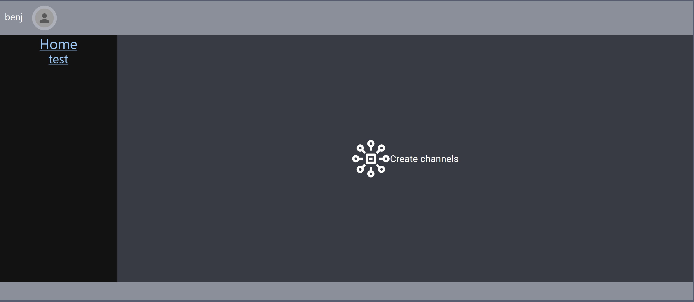
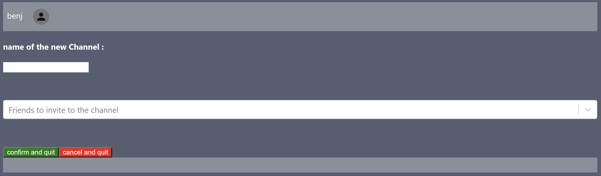
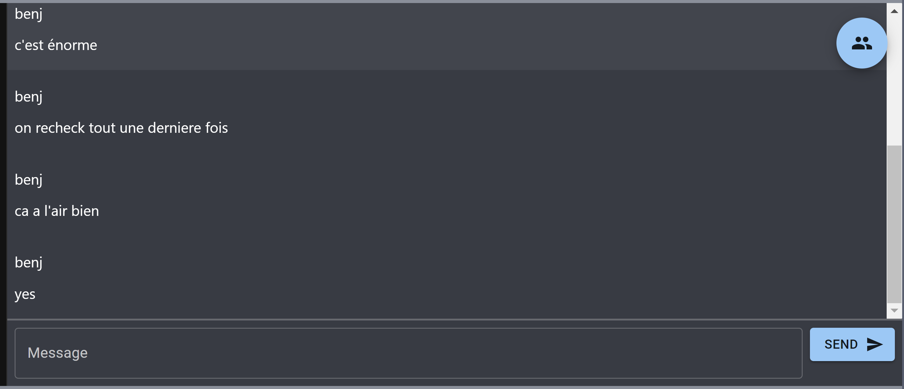
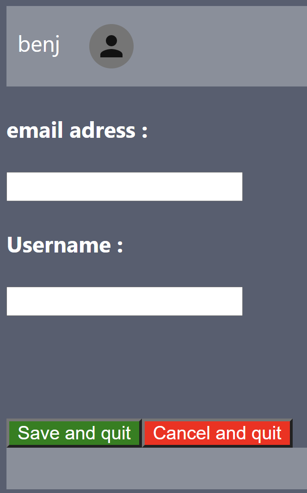

# Chat application 


## Usage

*how to start and use the application, run the tests, ...*

* Clone this repository, from your local machine.
* Install [Go](https://golang.org/) and [Dex](https://dexidp.io/docs/getting-started/). For example, on Ubuntu, from your project root directory:   
  ```
  # Install Go
  apt install golang-go
  # Download Dex
  git clone https://github.com/dexidp/dex.git
  # Build Dex
  cd dex
  make
  make examples
  ```
  Note, the provided `.gitignore` file ignores the `dex` folder.
* Register your GitHub application, get the `clientID` and `clientSecret` from GitHub and report them to your Dex configuration. Modify the provided `./dex-config/config.yml` configuration to look like:
  ```yaml
  - type: github
    id: github
    name: GitHub
    config:
      clientID: xxxx98f1c26493dbxxxx
      clientSecret: xxxxxxxxx80e139441b637796b128d8xxxxxxxxx
      redirectURI: http://127.0.0.1:5556/dex/callback
  ```
* Wet set up Dex in a Docker image so that we can use it from Windows. In order to launch the server you have to do the following commands : 
  ```yaml
  cd dex-config
  docker-compose up
  ```
* Start the back-end
  ```bash
  cd back-end
  # Install the required dependencies (npm or yarn)
  npm install
  # Start the back-end
  npm run start
  ```
* Start the front-end
  ```bash
  cd front-end
  # Install dependencies (use yarn or npm)
  yarn install
  # Start the front-end
  yarn start
  ```

## Author

- *Dinh Bach Nguyen (dinhbach.nguyen@edu.ece.fr)*

## Tasks

Project management

* Naming convention   
  __points : 2__
  
  Use of CamelCase, functions start with a minuscule and Component with an uppercase
  
* Project structure   
  **points : 4**
  
  
  
  `channel` and `icons` were already there. We added `Display` in which there are all the *main* components (Channels, Login, Welcome...) and `Component` in which you will find the *sub* components (components that are used as part of the main ones)
  
  
  
* Code quality   
  __points : 4__
  
  Use of CamelCase, variables are defined at the beginning of the function, clean indentation and line spacing between every functions
  
* Design, UX   
  __points : 1__
  
  very basic, nothing is hard to understand but noting is explicitly explained neither 
  
* Git and DevOps   
  __points: 0__
  
  No DevOps, very few Git commits

Application development

* Welcome screens   
  __points : 1.5__ 
  
  Didn't touch the UI, can only login via Github. We implemented a login Component (`Component/LogingForm.js`)  but didn't keep it as we needed to pass via Dex to get the authorization
  
  
  
  ​																				*Login Page*
  
  
  
  ​																				*Welcome Screen*
  
  
  
* New channel creation   
  **points : 4**
  
  Clicking the button at the middle of the Welcome page sends you to the `createchan` route where you will see this : 
  
  
  
  In the first field you put the name of the channel to create (a user can't have multiple channels with the same name & the channel must have a name).
  
  The second field (`react-select`)lets you select from the others users registered in the database the ones you want to include in the channel (you will be alone if you select no one)
  
  Clicking *Confirm and quit* will add the new channel to the database and send you back to `/channels` where you will see it on the left
  
  Clicking *Cancel and quit * will only take you back to `/channels`
  

- Channel membership and access   
    **points: 1.5**

  MIddleWare only used to check the acces to the channels. Since you need to access a channel in order to get its message the messages are implicitly protected by it too and there is no need to protect the users data. Checking user identity is done through it's ID and not it's email since he can change it in the settings

* Ressource access control   
  **points: 3**
  
  Each user only has access to the channels he is a part of
  
* Invite users to channels   
  __points : 6__
  
  
  
  ​																	*Channel  page*
  
  From this page you send messages to your friends, clicking the FAB on the top righ will display a form allowing you to invite new friends to the channel.
  
  A any moment you  can send `!members`  to get a list of all the members within the channel
  
* Message modification   
  **points : 2**
  
  
  
  Clicking on a message you sent make this data appears, changing the text in the text field and clicking on Edit will edit the message  
  
* Message removal   
  **points : 1**
  
  Same as for update except it doesn't work. Throughout the whole of this project we couldn't make the db.del() method of levelDb work, it's probably because we send the wrong return value afterwards. The axios request has the correct return value (203) but the db doesn't change
  
* Account settings   
  **points : 2**
  
  
  
  Very basic, you can change your email and user name as they are the only to *client-side* data of the user. A good way to populate the database is to change the email and Save, it will create a new user with a new id and you will get your data back by logging in through Dex. The user name is displayed in the Header and is the one written when you send a message
  
* Gravatar integration   
  
  **points : 0**
  
* Avatar selection   
  
  **points : 0**
  
* Personal custom avatar   
  **points : 0**

## Bonus

*place your graduation and comments*
